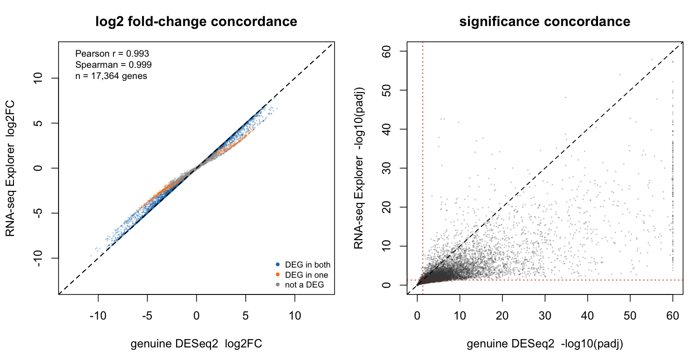

# Validation — RNA-seq Explorer vs. genuine DESeq2

This folder demonstrates that **RNA-seq Explorer reproduces genuine DESeq2** on a real,
public mouse RNA-seq dataset. It answers the reviewer-relevant question directly:
*here is a dataset, here is what real DESeq2 gives, and here is RNA-seq Explorer
producing the same result.*

## Summary

On **17,364** commonly-tested genes (mouse mammary **basal vs. luminal**, GSE60450),
the tool's in-browser DESeq2-*style* engine agrees with **genuine DESeq2 1.46.0** as follows:

| Metric | Value |
|---|---|
| Pearson *r* (log₂FC) | **0.993** |
| Spearman ρ (log₂FC) | **0.999** |
| Median \|Δ log₂FC\| | **0.005** |
| Genes within 0.5 log₂FC | **92.9%** |
| Sign concordance (genes significant in either) | **100%** |
| DESeq2 DEGs (padj < 0.05 & \|log₂FC\| > 1) | 6,873 |
| RNA-seq Explorer DEGs (same thresholds) | 6,222 |
| Overlap | 6,117 |
| **Precision** (tool DEG is also a DESeq2 DEG) | **98.3%** |
| **Sensitivity** (recovers a DESeq2 DEG) | **89.0%** |
| Specificity | 99.0% |
| Jaccard | 0.877 |

**Interpretation.** Fold-changes are essentially identical to DESeq2 (median difference
0.005 log₂ units; *r* = 0.993) and directions never disagree (100% sign concordance).
When the tool calls a gene differentially expressed it is right **98.3%** of the time by
DESeq2's own standard, and it recovers **89%** of DESeq2's DEGs. The remaining ~11% are
borderline genes near the significance cutoff where the in-browser approximation is
slightly **more conservative** — visible in `lfc_concordance.png` (right panel) as points
falling just below the diagonal. This is the honest, expected behavior of a fast
approximation, and it errs toward *fewer* false positives.



## Dataset

- **GEO accession GSE60450** — mouse mammary epithelium sorted into **basal** and
  **luminal** populations across virgin/pregnant/lactating states (Fu et al., 2015; the
  dataset used in the Bioconductor RNA-seq training workflows). Publicly available,
  gene-wise raw counts.
- **Contrast used:** all **6 basal** vs. all **6 luminal** samples (developmental state
  left as within-group variation), reference level = `basal`, so positive log₂FC = up in
  luminal.
- **Gene IDs:** Entrez → **MGI symbol** via `org.Mm.eg.db` (counts summed over duplicate
  symbols), giving a symbol-keyed matrix — exactly the mouse-symbol input the app accepts.
- **Biological sanity check (both methods agree):** luminal markers up
  (*Csn2* +6.8, *Elf5* +5.9, *Krt18* +4.0), basal/myoepithelial markers down
  (*Krt5* −8.9, *Acta2* −9.0, *Myh11*, *Cnn1*, *Tpm2*).

## What this validates

1. **In-browser approximation ≈ genuine DESeq2** — the metrics/figure above. Both methods
   were run on the *same* count matrix with matched options.
2. **Import path = genuine DESeq2, exactly** — RNA-seq Explorer's **Import DESeq2 output**
   feature loads a DESeq2 results table directly and every view (Volcano, DEG table,
   Scatter, Pathways, TF) reads those exact numbers. You can verify this by dropping
   `expected_deseq2_results.csv` onto **⬆ Import DESeq2 output** in the app: the displayed
   values are the file's values, unchanged.

## Method / settings (kept apples-to-apples)

Both engines used median-of-ratios normalization and a Wald test. To compare like with
like, the in-browser run was configured to match the reference DESeq2 run:

| Setting | Reference DESeq2 | RNA-seq Explorer |
|---|---|---|
| Fold-change | unshrunken MLE (`results()`) | shrink **off** |
| Low-count filter | `rowSums ≥ 10` (pre-filter) | `rowSums > 9` (identical for integers) |
| Cook's outliers | default (`cooksCutoff`) | **DESeq2-faithful** mode |
| Reference level | `basal` | control = `basal` |

## Files

| File | What it is |
|---|---|
| `run_validation_deseq2.R` | Reproducible backbone: downloads GSE60450, maps IDs, runs **genuine DESeq2**, writes the inputs + reference results. |
| `mouse_counts.csv` | Tool-ready raw count matrix (MGI symbol + 12 samples). |
| `sample_metadata.csv` | Sample → group (basal / luminal). |
| `expected_deseq2_results.csv` | **Genuine DESeq2** output — the reference. |
| `tool_results.csv` | RNA-seq Explorer's own per-gene output on the same matrix (6 vs 6). |
| `concordance_metrics.tsv` | The numbers in the summary table. |
| `make_figures.R` | Recomputes the metrics and renders the figure from `tool_results.csv`. |
| `lfc_concordance.png` | Two-panel concordance figure. |
| `screenshots/tool_volcano_basal_vs_luminal.png` | The app's volcano on this dataset. |
| `sessionInfo.txt` | Exact R / package versions. |
| `GSE60450_counts.txt.gz` | Raw GEO input (kept for offline reproducibility). |

## Reproduce

```bash
# 1. Reference DESeq2 numbers + tool-ready inputs (needs R + DESeq2 + org.Mm.eg.db)
Rscript run_validation_deseq2.R

# 2. Load mouse_counts.csv into RNA-seq Explorer:
#    control (ref) = basal, treatment = luminal, shrink OFF, min-count rowSums>9,
#    Cook's = DESeq2-faithful. Export the DEG table as tool_results.csv.

# 3. Concordance metrics + figure
Rscript make_figures.R
```

## Honest notes / scope

- The in-browser engine is a DESeq2-**style** approximation intended for fast exploration.
  For values reported in a manuscript, use **Run real DESeq in R** → **Import DESeq2
  output**, which puts genuine DESeq2 numbers into every view (validation claim #2).
- Near the significance boundary the approximation is slightly conservative (89%
  sensitivity), so it may miss a few of DESeq2's borderline DEGs; it does not invent
  extra ones (98.3% precision).
- This validates the mouse workflow (the app is currently mouse-specific). The same
  procedure with the human `airway` dataset is the plan for the human-support release.

## Versions

R 4.4.2 · DESeq2 1.46.0 · org.Mm.eg.db · RNA-seq Explorer **V38**. Full details in
`sessionInfo.txt`.
